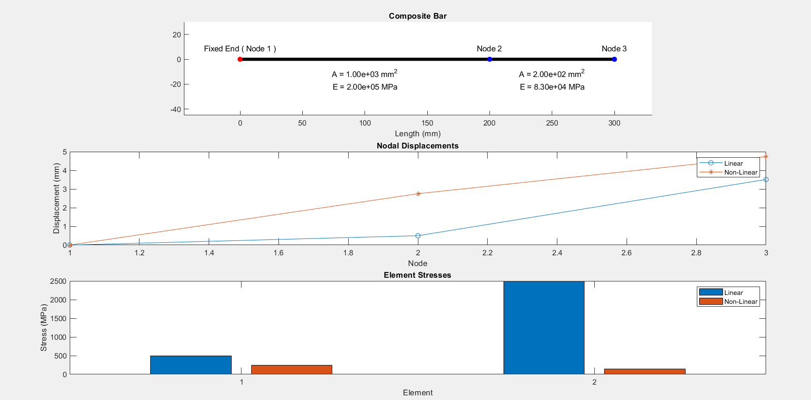
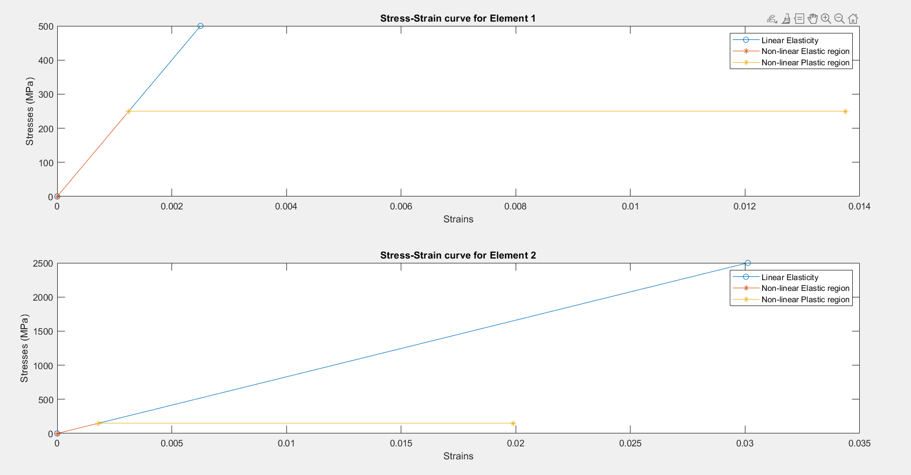

# Analysis of Axial Deformation in Composite Bars using 1D Finite Element Method (FEM)

This MATLAB project models **axial deformation** in **composite bars** under various loading conditions using the **1D Finite Element Method**.  
It performs both **linear elastic** and **non-linear elasto-plastic** analyses to study stress, strain, and displacement behavior across the bar.

---

## 📚 Abstract

Composite bars made of materials like steel and aluminum are analyzed to understand how different materials respond to loads.  
The project compares **linear (Hooke’s law)** and **non-linear (elasto-plastic)** behavior.  
In non-linear cases, the stiffness reduces once the stress exceeds the yield stress, modeling material yielding accurately.  
The results demonstrate that non-linear analysis predicts higher displacements than linear analysis, highlighting the effect of material non-linearity.

---

## 🧠 Methodology

1. **Problem Definition:** Define bar geometry, materials, and boundary conditions.  
2. **Discretization:** Divide the composite bar into 1D finite elements.  
3. **Finite Element Formulation:** Assemble element stiffness matrices into a global stiffness matrix.  
4. **Linear Analysis:** Solve for nodal displacements, element strains, and stresses using Hooke’s law.  
5. **Non-linear Modeling:** Introduce yield stress and elasto-plastic behavior (reduced stiffness = 0.1E beyond yield).  
6. **Post-Processing:** Compute and visualize linear and non-linear responses.  
7. **Result Validation:** Compare linear and non-linear outcomes.

---

## 🧹 Features

- Interactive **user input** for:
  - Number of elements  
  - Element lengths and areas  
  - Young’s modulus and yield stress  
  - Node loads  

- **Linear and Non-linear analysis** comparison  
- **Automatic stiffness matrix assembly** and solution  
- **Stress–strain curves** for each element  
- **Graphical visualization** of:
  - Composite bar geometry  
  - Linear vs. Non-linear displacement  
  - Element stress comparison  

---

## ⚙️ How to Run

1. Open MATLAB.  
2. Copy the MATLAB script code into a file named:

   ```matlab
   oneD_bar_FEM.m
   ```

3. Run the script in MATLAB:

   ```matlab
   >> oneD_bar_FEM
   ```

4. Enter inputs as prompted:
   - Number of elements  
   - Length, area, modulus of elasticity, yield stress for each element  
   - Node loads  

5. MATLAB will display:
   - Linear and Non-linear nodal displacements  
   - Element strains and stresses  
   - Stress–strain plots for each element  
   - Comparison graphs between both analyses  

---

## 📊 Outputs Generated

**Linear Analysis**
- Nodal displacements  
- Element strains  
- Element stresses  

**Non-Linear Analysis**
- Elastic and plastic strain components  
- Capped stresses at yield stress  
- Updated nodal displacements  

**Graphs and Visuals**
- Composite bar with element labeling  
- Linear vs. Non-linear displacement curves  
- Stress comparison bar chart  
- Stress–strain plots for each element showing:
  - Linear region  
  - Elastic region  
  - Plastic region  

---

## Results





---

## Key Equations

**Element Stiffness:**

`k_e = AE / L`

**Strain (Linear):**

`ε = (u_{i+1} - u_i) / L`

**Stress (Linear):**

`σ = E * ε`

**Yield-Limited Stress (Non-Linear):**

`σ = sign(σ) × σ_y`

**Plastic Strain (Approximation):**

`ε_p = (σ / E) × 0.1`

---

## 🧹 Results Summary

- **Nodal Displacements:**  
  Non-linear analysis predicts higher displacements due to yielding.

- **Element Stresses:**  
  Linear analysis shows constant stress per element, while non-linear analysis redistributes stress.

- **Stress–Strain Behavior:**  
  Each element exhibits a linear region followed by non-linear elastic and plastic deformation zones.

---

## 👨‍🎓 Contributors

| Name           | Role                                   |
|----------------|---------------------------------------|
| Jayant Lodhi   | MATLAB Implementation, Theoretical Analysis, Non-linear Model Validation & Documentation |

**Mentor:** Dr. Jofin George — Assistant Professor, IIIT Hyderabad

---

## 📚 References

- Reddy, J. N. (2005). *Introduction to Finite Element Analysis and Design*. Wiley.  
- Bhatti, M. A. (2005). *Fundamental Finite Element Analysis and Applications with MATLAB Computations*. Wiley.

---

## 📜 Aknowledgements
- This project was developed as part of coursework / term project.
- This MATLAB project is open for **educational and research use**.
